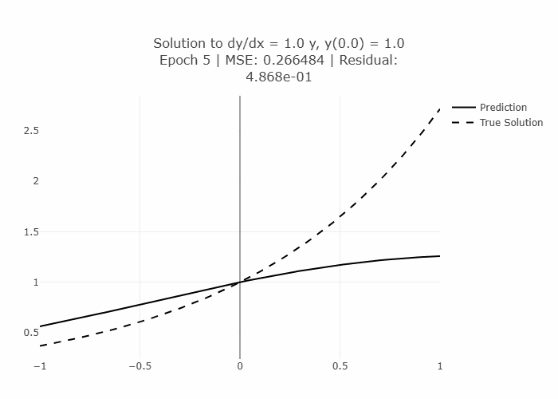

# Physics-Informed Neural Networks for ODEs and Systems

This repository contains a module for using a physics-informed neural network (PINN) to solve ordinary differential equations (ODEs) and systems of ODEs.  
It also contains a Streamlit app that allows the user to select a differential equation, initial condition(s), and, in some cases, parameters.  
The app then generates the solution using a neural network and displays a Plotly graph showing intermediate and final solutions.  
Analytic solutions (where available) are shown for comparison.

### Approach

The approach begins by sampling points within the target interval for which we want to approximate the solution.

More specifically, suppose we have the initial value problem:

$$
F(x, y, y', \ldots, y^{(k)}) = 0
$$

$$
y(x_0) = y_0, \quad y'(x_0) = y_1, \ldots, \quad y^{(k-1)}(x_0) = y_{k-1}
$$

We then create a neural network that we will refer to as $NN$ and assume our solution has the form:

$$
y = \sum_{n=0}^{k-1} \frac{y^{(n)}(x_0)(x - x_0)^n}{n!} + (x - x_0)^k  NN(x - x_0)
$$

This construction is motivated by the fact that if the true solution is analytic at $x_0$, it admits a Taylor series expansion:

$$
y = \sum_{n=0}^{\infty} \frac{y^{(n)}(x_0)}{n!}(x - x_0)^n
$$

From the initial conditions, we can separate out the terms for $y, y', \ldots, y^{(k-1)}$:

$$
y = \sum_{n=0}^{k-1} \frac{y^{(n)}(x_0)(x - x_0)^n}{n!} + \sum_{n=k}^{\infty} \frac{y^{(n)}(x_0)(x - x_0)^n}{n!}
$$

For all the terms in the second summand we can factor out $(x - x_0)^k$ to obtain:

$$
y = \sum_{n=0}^{k-1} \frac{y^{(n)}(x_0)(x - x_0)^n}{n!} + (x - x_0)^k \sum_{n=k}^{\infty} \frac{y^{(n)}(x_0)(x - x_0)^{(n-k)}}{n!}
$$

The first half of that sum is the summation in our trial solution. The second half can be thought of as $(x - x_0)^k  F(x)$, where $F$ is some function analytic at $x_0$.  
So the neural network $NN(x)$ is trying to learn to approximate $F(x)$ as a function "centered" at $x_0$.

---

#### Why not just let $y = NN(x)$ and include the initial conditions as part of the loss function?

In theory, this can work. The issue is that this focuses a large part of the loss function on the initial conditions, and it makes learning to stay along with the initial conditions while also using the differential equation difficult.  

One can attempt to balance this by weighting loss from the initial conditions compared to loss from the differential equation, but that's another hyperparameter that would have to be tuned.  

With the setup we use, we can define the loss function as:

$$
L(x) = \frac{1}{|X|} \sum_{x \in X} \big(F(x, y(x), y'(x), \ldots, y^{(k)}(x))\big)^2
$$

which is the mean square residual comparing $F$ to $0$.
This approach automatically enforces the initial conditions exactly, leaving the network free to learn only the behavior constrained by the differential equation itself.

### Contents of the repository

- `pinn_utils/pinn.py`: Contains the `PINN` class and `solve` function.
  - `PINN` creates a feed-forward neural network with input, hidden, and output layers. Activation functions can be specified per layer.
  - `ode_solve` trains the network to minimize the residual of a given DE, using initial conditions and the supplied `F` function.
  - `train` is a generic utility that can train any PyTorch network on one or more datasets using a supplied loss function — similar to `model.fit()` in Keras, but with full PyTorch flexibility
- `pinn_utils/de_sols.py`: Analytic solutions for example DEs used in the app.

- `pinn_utils/ode_meta.py`: Dictionary of metadata for each DE. Includes order, parameters, `F` function, analytic solution (if available), and display information.

- `stpinn.py`: Streamlit app demonstrating the solver and showing analytic solutions for comparison.
- `test_all_desols.py`: Unit test using numeric differentiation approximation to verify that the analytic solutions are correct

Example usage to solve $y' = y$, $y(0)=1$ on $[-1,1]$
```python
# necessary imports
import torch
import torch.nn as nn
from pinn_utils import pinn

# create the neural network
NN = pinn.PINN(
  num_hidden_layers=2,
  layer_width=64,
  input_activation=nn.Tanh(),
  hidden_activation=nn.Tanh(),
  output_activation=nn.Identity(),
  num_inputs=1,
  num_outputs=1
)

# set up the differential equation and initial conditions
# and the interval over which it will be solved
F = lambda x, y, dy: dy - y  # Equation y'=y
a = 0                        # x_0 = 0
ics = [1]                    # y_0 = 1
x = torch.linspace(-1, 1, 200).reshape(-1,1)   # interval [-1,1]

# run the solver
solution = pinn.ode_solve(
    F=F,
    a=a,
    ics=ics,
    NN=NN,
    X=x,
    epochs=1000,
    lr=1e-3
)

# evaluation
y_values = solution(x)
```
If we look at the first 125 epochs we can see that it converges quite well to the true solution ($y=e^x$)


#### Internal functions
`get_y_trial` : generates the trial function, given $x_0$, the initial conditions, and `NN`

`get_loss` : Generates the loss function using initial conditions, the neural network, and the differential equation $F$.

### Running the Streamlit App

You can launch the interactive Streamlit app to experiment with both single ODEs and systems of ODEs:

```bash
pip install -r requirements.txt
streamlit run stpinn.py
```

You can access the app already on [Streamlit Cloud](https://pinnsolver.streamlit.app)
#### Features in the app:

-Select from example differential equations or systems.

-Enter initial conditions and parameters.

-View the neural network solution evolving over training epochs via an animated Plotly graph.

-Compare the PINN solution to the analytic solution (if available).

-Adjust the time interval for the solution and network hyperparameters like number of hidden layers, layer width, activation functions, learning rate, and number of epochs.

#### Notes on systems of ODEs:

-For linear systems like $y' = A y$, enter the components of the matrix $A$ and the initial vector $y_0$.

-The x/y plot shows the trajectory of the system in phase space.

-Analytic solutions (where available) are displayed for comparison.

