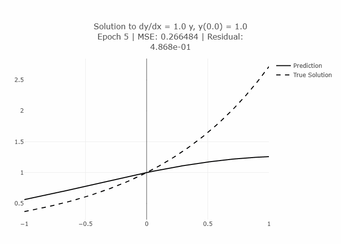

# Physics-Informed Neural Networks for ODEs and Systems

This repository contains a module for using a physics-informed neural network (PINN) to solve ordinary differential equations (ODEs) and systems of ODEs.  
It also contains a Streamlit app that allows the user to select a differential equation, initial condition(s), and, in some cases, parameters.  
The app then generates the solution using a neural network and displays a Plotly graph showing intermediate and final solutions.  
Analytic solutions (where available) are shown for comparison.

### Approach for ODEs

The approach begins by sampling points within the target interval for which we want to approximate the solution.

More specifically, suppose we have the initial value problem:

$$
F(x, y, y', \ldots, y^{(k)}) = 0
$$

$$
y(x_0) = y_0, \quad y'(x_0) = y_1, \ldots, \quad y^{(k-1)}(x_0) = y_{k-1}
$$

We then create a neural network that we will refer to as $NN$ and assume our solution has the form:

$$
y = \sum_{n=0}^{k-1} \frac{y^{(n)}(x_0)(x - x_0)^n}{n!} + (x - x_0)^k  NN(x - x_0)
$$

This construction is motivated by the fact that if the true solution is analytic at $x_0$, it admits a Taylor series expansion:

$$
y = \sum_{n=0}^{\infty} \frac{y^{(n)}(x_0)}{n!}(x - x_0)^n
$$

From the initial conditions, we can separate out the terms for $y, y', \ldots, y^{(k-1)}$:

$$
y = \sum_{n=0}^{k-1} \frac{y^{(n)}(x_0)(x - x_0)^n}{n!} + \sum_{n=k}^{\infty} \frac{y^{(n)}(x_0)(x - x_0)^n}{n!}
$$

For all the terms in the second summand we can factor out $(x - x_0)^k$ to obtain:

$$
y = \sum_{n=0}^{k-1} \frac{y^{(n)}(x_0)(x - x_0)^n}{n!} + (x - x_0)^k \sum_{n=k}^{\infty} \frac{y^{(n)}(x_0)(x - x_0)^{(n-k)}}{n!}
$$

The first half of that sum is the summation in our trial solution. The second half can be thought of as $(x - x_0)^k  F(x)$, where $F$ is some function analytic at $x_0$.  
So the neural network $NN(x)$ is trying to learn to approximate $F(x)$ as a function "centered" at $x_0$.

---

#### Why not just let $y = NN(x)$ and include the initial conditions as part of the loss function?

In theory, this can work. The issue is that this focuses a large part of the loss function on the initial conditions, and it makes learning to stay along with the initial conditions while also using the differential equation difficult.  

One can attempt to balance this by weighting loss from the initial conditions compared to loss from the differential equation, but that's another hyperparameter that would have to be tuned.  

With the setup we use, we can define the loss function as:

$$
L(x) = \frac{1}{|X|} \sum_{x \in X} \big(F(x, y(x), y'(x), \ldots, y^{(k)}(x))\big)^2
$$

which is the mean square residual comparing $F$ to $0$.
This approach automatically enforces the initial conditions exactly, leaving the network free to learn only the behavior constrained by the differential equation itself.

### Approach for PDEs
The technique used for ODEs doesn't translate very well to PDEs.  
While an ODE typically has initial conditions specified only at a point (e.g. $y(x_0), y'(x_0), \ldots$),  
a PDE involves conditions defined over regions or boundaries — for example, $u(0,t) = f(t)$ — which cannot be incorporated into the same functional trial form used for ODEs. So, for the PDEs, the approach is as follows :
- Start with a DE of the form $F(u,u_x,u_y,u_{xx},u_{xy},u_{yy},\ldots) = 0$ and a set $X_{DE}$ where that equation is intended to hold, along with an optional weight $w_{DE}$.
- For each initial condition, define a pair $(X_{IC}, residual_{IC})$, where the condition enforces $residual_{IC} = 0$ on $X_{IC}$ with an optional weight $w_{IC}$.
- For each boundary condition, define a similar pair $(X_{BC}, residual_{BC})$, with an optional weight $w_{BC}$.
- The loss function $L = w_{DE}\overline{F(X_{DE})^2} + \sum\nolimits_{X_{IC} \in IC-sets} w_{IC} \overline{residual_{IC}(X_{IC})^2}+ \sum\nolimits_{X_{BC} \in BC-sets} w_{BC} \overline{residual_{BC}(X_{BC})^2}$

Here, the idea is to take the sum of mean-square residuals from the differential equation, initial conditions, and boundary conditions over their respective sets. This gets passed as the loss function to a PINN to train with.

### Contents of the repository

- `pinn_utils/pinn.py`: Contains the `PINN` class and functions necessary to train a PINN for a solution to a differential equation.
  - `PINN` creates a feed-forward neural network with input, hidden, and output layers. Activation functions can be specified per layer.
  - `ode_solve` trains the network to minimize the residual of a given DE, using initial conditions and the supplied `F` function.
  - `pde_solve` trains the network to minimize the residuals involved for a PDE with initial conditions and boundary conditions
  -  `compute_unique_derivatives` takes a function, a set X, and an order and computes all partial derivatives of f up to that order on X
  - `train` is a generic utility that can train any PyTorch network on one or more datasets using a supplied loss function — similar to `model.fit()` in Keras, but with full PyTorch flexibility
- `pinn_utils/de_sols.py`: Analytic solutions for example DEs used in the app.

- `pinn_utils/ode_meta.py`: Dictionary of metadata for each DE. Includes order, parameters, `F` function, analytic solution (if available), and display information.

- `stpinn.py`: Streamlit app demonstrating the solver and showing analytic solutions for comparison.
- `test_all_desols.py`: Unit test using numeric differentiation approximation to verify that the analytic solutions are correct
- [`wave_eq.ipynb`](./wave_eq.ipynb): A sample notebook with an example of solving a wave equation.


Example usage to solve $y' = y$, $y(0)=1$ on $[-1,1]$
```python
# necessary imports
import torch
import torch.nn as nn
from pinn_utils import pinn

# create the neural network
NN = pinn.PINN(
  num_hidden_layers=2,
  layer_width=64,
  input_activation=nn.Tanh(),
  hidden_activation=nn.Tanh(),
  output_activation=nn.Identity(),
  num_inputs=1,
  num_outputs=1
)

# set up the differential equation and initial conditions
# and the interval over which it will be solved
F = lambda x, y, dy: dy - y  # Equation y'=y
a = 0                        # x_0 = 0
ics = [1]                    # y_0 = 1
x = torch.linspace(-1, 1, 200).reshape(-1,1)   # interval [-1,1]

# run the solver
solution = pinn.ode_solve(
    F=F,
    a=a,
    ics=ics,
    NN=NN,
    X=x,
    epochs=1000,
    lr=1e-3
)

# evaluation
y_values = solution(x)
```
If we look at the first 125 epochs we can see that it converges quite well to the true solution ($y=e^x$)



We can also look at a PDE example. Here we'll consider a simple version of the wave equation :
$$u_{tt} = c^2 u_{xx}$$
Initial conditions:
$$ u(x,0) = \sin(\pi x), u_t(x,0) = 0$$
Boundary conditions
$$ u(0,t) = u(1,t) = 0 $$
In our example we will use $c=1$
```python
# necessary imports
import math
import torch
from pinn_utils import pinn

# setup the PINN
NN = pinn.PINN(
    num_inputs = 2,   # 2 inputs x,t
    num_hidden_layers=4, # 4 hidden layers (with default width of 64)
    input_activation=torch.sin, # activation function is sin for input layer
    hidden_activation=torch.sin # activation function is sin for hidden layers
    )

# set up residual functions
# first the main equation u_tt = c^2 u_xx. In our example c is 1
def wave_eq(u, X, c=1.0):
    # compute the first and second order derivatives of NN 
    # here x0 is the first independent variable, x, and x1 is the 2nd independent variable, t.
    derivs = pinn.compute_unique_derivatives(lambda x: u(x), X, order=2)[0]
    # return NN_tt - c**2 * NN_xx
    return derivs["x1_x1"] - c**2 * derivs["x0_x0"]
# this is for the initial condition that u(x,0) = sin(pi * x)
def f_ic(u, X):
    # return shape (N,1)
    return u(X) - torch.sin(math.pi * X[:, 0:1])

# for the initial condition that u_t(0,t) = 0
def g_ic(X):
    # in this case g(x)=0, but keep shape (N,1)
    return torch.zeros_like(X[:, 0:1])

# derivative-IC callable: returns du_dt - g(X) 
# in this example g(X) = 0
def ut_IC( u, X):
    # this takes an arbitrary function and set X and returns 
    # du/dt(X) - g_ic(X)
    derivs = pinn.compute_unique_derivatives(lambda x: u(x), X, order=1)[0]
    du_dt = derivs["x1"].unsqueeze(1)   # derivative w.r.t. t
    return du_dt - g_ic(X)        # return residual shape (N,1)

# for the boundary conditions u(0,t) = u(1,t) = 0, the residual is just the output of the function
u_bc0 = lambda u, X : u(X)
u_bc1 = lambda u, X : u(X)

# now setting up the points to train on. we'll simply choose random points in each set
# for the differential equation the set of points is the square [0,1] x [0,1]
X_DE = torch.rand(5000, 2)  # (x,t) in [0,1]x[0,1]
# for the initial conditions we consider [0,1] x 0:
X_IC = torch.cat([torch.rand(500,1), torch.zeros(500,1)], dim=1)
# for the boundary conditions we need 0 x [0,1] and 1 x [0,1]
X_BC0 = torch.cat([torch.zeros(500,1), torch.rand(500,1)], dim=1)
X_BC1 = torch.cat([torch.ones(500,1), torch.rand(500,1)], dim=1)
# now we put the ICs and BCs as sets of pairs
IC_list = [
    (X_IC, f_ic),
    (X_IC, ut_IC)
]
BC_list = [
    (X_BC0, u_bc0),
    (X_BC1, u_bc1)
]

# to solve we use pde_solve
# invoke the solver with the DE, X_DE, network, and ICs/BCs
solution = pinn.pde_solve(
    DE=wave_eq,
    X_DE=X_DE,
    NN=NN,
    IC_list=IC_list,
    BC_list=BC_list
)
```
#### Internal functions
`get_y_trial` : Generates the trial function, given $x_0$, the initial conditions, and `NN`

`get_loss` : Generates the loss function using initial conditions, the neural network, and the differential equation $F$.

`get_pde_loss` : Generates the loss function from the DE, ICs, and BCs for a PDE

(Other utility functions such as `compute_unique_derivatives` and `train` are documented in the main module description above.)

### Running the Streamlit App

You can launch the interactive Streamlit app to experiment with both single ODEs and systems of ODEs:

```bash
pip install -r requirements.txt
streamlit run stpinn.py
```

You can access the app already on [Streamlit Cloud](https://pinnsolver.streamlit.app)
#### Features in the app:

- Select from example differential equations or systems.

- Enter initial conditions and parameters.

- View the neural network solution evolving over training epochs via an animated Plotly graph.

- Compare the PINN solution to the analytic solution (if available).

- Adjust the time interval for the solution and network hyperparameters like number of hidden layers, layer width, activation functions, learning rate, and number of epochs.

#### Notes on systems of ODEs:

- For linear systems like $y' = A y$, enter the components of the matrix $A$ and the initial vector $y_0$.

- The x/y plot shows the trajectory of the system in phase space.

- Analytic solutions (where available) are displayed for comparison.